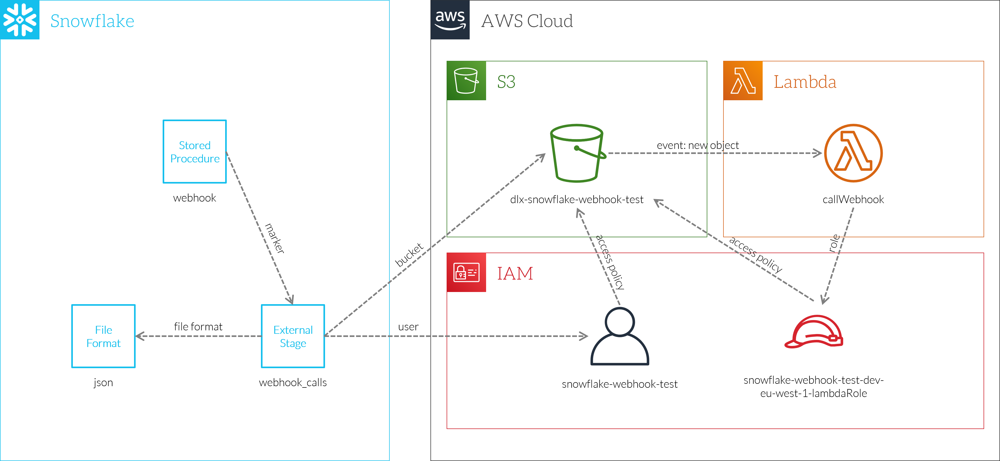
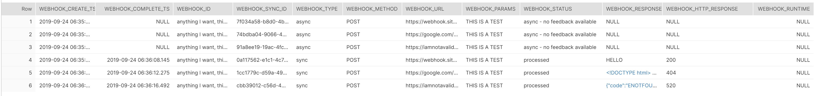
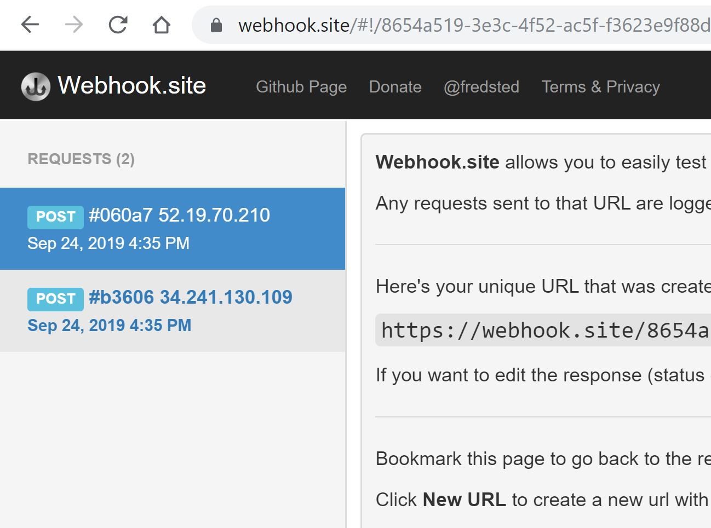

# snowflake-webhooks
A work around implementation to allow webhooks to be called from inside Snowflake. This allows powerful bidirectional integration between Snowflake and other external systems.

# Why
[TO DO]

# Limitations
This only works using AWS S3 and Lambda. Everything being used has equivalents in Azure and other Cloud Providers. Since the provision of this is done via using the serverless Application Framework, porting to other Cloud Providers should be straightforwards. Pull requests welcome!

This code doesn't remove the temporary request and response files from the S3 bucket. If you want to clean these up this is left as a homework exercise.

The reliability of the delivery from Snowflake to S3 to trigger the Lamda function is based on the reliability of S3 events. Nothing is provided beyond this at the application level.

HTTP Verbs other than POST are technically supported but have not been extensively tested.

WEBHOOK_RUNTIME is not currently populated but since the STARt and COMPLETE times are populated, this is trival to derive.

# Architecture
Since there is no ability to execute arbitrary code (or at least code that can talk out on a network) from within Snowflake, we need to take a slightly different approach. Instead the approach we take is to create 'markers' from within Snowflake that an external system can pickup on and then action.



The logical flow is as follows:
* A call to  the ```webhook_sync``` or ```webhook_async``` procedures are called from anywhere inside Snowflake
* This creates a row in a metadata table in the ```WEBHOOK_METADATA``` database
* If the async method is being used, the function now returns with a unique webhook id and execution of your code continues
* This also creates a file in the ```WEBHOOK_METADATA_OUT``` stage on S3
* The creation of this file triggers a Lambda function to execute
* This Lambda function does the actual work of calling the external webhook, passing the data and recieving the response. Note: this means the source address of the webhook call will be from the pool used by AWS Lambda, not Snowflake
* The Lambda function writes a file in the ```WEBHOOK_METADATA_IN```  stage and triggers a read from this
* This updates the row in the metadata table with various parameters e.g. the execution time, the HTTP response code and payload
* If the sync method is being used then the procedure has been polling the metadata table, waiting for the response information to appear (or a timeout to be hit) and then returns an object with the HTTP response code and payload


# Setup
In order to setup your system to run webhooks you will need:
* A Snowflake account including the SYSADMIN ROLE etc
* An AWS account with the following permissions permissions to create IAM Roles, Lambda Functions, S3 Buckets etc
* A machine to run the creation scripts from. This machine is only needed for setup, not for ongoing operation. This machine needs
* The Serverless Application Framework (usually ```npm install -g serverless``` if not check Serverless documentation)
* This repository (usually ```git clone https://github.com/datalytyx/snowflake-webhooks.git```)

# Installation
Since information specific to you is contained in sql scripts, the script from this repo is a template and needs to be customised to you envrionment. You can do this by hand or just use the trivial commands below:

```
export SNOWFLAKE_METADATA_DATABASE="WEBHOOK_METADATA"
export SNOWFLAKE_METADATA_SCHEMA="PUBLIC"
export AWS_KEY_ID="<your aws key>"
export AWS_SECRET_KEY="<your aws secret>"
export AWS_S3_REGION="eu-west-1"
export S3_BUCKET="your_desired_s3_bucket_location"   # note this will be created for you and cannot already exist
```
The use the following commands to convert the template files into ones personalised for you:
```
cat setup.sql.template | sed -e "s~{SNOWFLAKE_METADATA_DATABASE}~$SNOWFLAKE_METADATA_DATABASE~g" | sed -e "s~{SNOWFLAKE_METADATA_SCHEMA}~$SNOWFLAKE_METADATA_SCHEMA~g" | sed -e "s~{S3_BUCKET}~$S3_BUCKET~g" | sed -e "s~{AWS_KEY_ID}~$AWS_KEY_ID~g" | sed -e "s~{AWS_SECRET_KEY}~$AWS_SECRET_KEY~g" > setup.sql

cat serverless.yaml.template | sed -e "s~{S3_BUCKET}~$S3_BUCKET~g" > serverless.yaml

cat lambda.js.template  | sed -e "s~{AWS_S3_REGION}~$AWS_S3_REGION~g" > lambda.js
```


## Setup lambda functions and triggers from S3 bucket
Assuming you already have your AWS credentials setup using ```aws configure```, all you need to do is run:

```
serverless deploy
```

## Setting up Snowflake
While you can execute the contents of ```setup.sql``` from the CLI (e.g. using snowsql), since this is only a one time setup script the easiest thing to do is to simply open up a Snowflake workbook in your browser, paste the contents of setup.sql in and execute. 

In the Workbench be sure to use the SYSADMIN role and set a warehouse just to run the setup script as. Note that the execution for the webhook procedures themselves will be using whichever user, role and warehouse the calling code is using i.e. the procedures don't change any of these.

Leave a Snowflake workbook open for testing next. 

After executing this script you will need to grant SELECT and UPDATE priviledges to this database to ROLES you want to be able to call webhooks.

## Testing
A simple way is to use https://webhook.site/ - it will give you a test URL like ```https://webhook.site/38c60cba-dc45-424e-9f9a-f8e83fa0dc4f``` that you can use to test webhooks, check they are being called correctly and set payload responses for testing.

To test that everything is working run the following in Snowflake

```
set myid='anything I want, this is just for me'; 
set payload='THIS IS A TEST';
set good_webhook_url='https://webhook.site/<yoururl>';
set notfound_webhook_url='https://google.com/iamnotavalidpath';
set bad_webhook_url='https://iamnotavalidurl.com';
```

Be sure to set your good_webhook_url to the one you created yourself at webhook.site

You can then run the following test cases:

```
call call_webhook_async ($myid,$good_webhook_url,'POST',$payload);
call call_webhook_async ($myid,$notfound_webhook_url,'POST',$payload);
call call_webhook_async ($myid,$bad_webhook_url,'POST',$payload);
```

You should see a response pretty quickly that says:

```
Webhook sucessfully registered for execution
```

This means that a row has been written to the SNOWFLAKE_METADATA_DATABASE you defined and a file has been created in the S3 bucket. Assuming the Lambda function has been setup correctly the writing of this file will trigger the Lamba function. The AWS Lambda pages provide excellent functionality to check that jobs have been executed, whether they ran sucessfully or not and see the logs for the function. You can also get these logs streamed to you in real-time (with some delay) by running:

```
serverless logs --function callWebhook --tail
```
Which is very useful for debugging.


The following sync calls DO return different results:

```
call call_webhook_sync ($myid,$good_webhook_url,'POST',$payload);
```

should give a response like:

```
{"httpStatusCode":"200","body":"HELLO"}
```

Where ```HELLO``` was the HTTP Response I setup when I created my URL at webhook.site

```
call call_webhook_sync ($myid,$notfound_webhook_url,'POST',$payload);
```
should give a response like:

```
{"httpStatusCode":"404","body":"<!DOCTYPE html>
<html lang=en>
  <meta charset=utf-8>
  <meta name=viewport content="initial-scale=1, minimum-scale=1, width=device-width">
  <title>Error 404 (Not Found)!!1</title>
  <style>
    *{margin:0;padding:0}html,code{font:15px/22px arial,sans-serif}html{background:#fff;color:#222;padding:15px}body{margin:7% auto 0;max-width:390px;min-height:180px;padding:30px 0 15px}* > body{background:url(//www.google.com/images/errors/robot.png) 100% 5px no-repeat;padding-right:205px}p{margin:11px 0 22px;overflow:hidden}ins{color:#777;text-decoration:none}a img{border:0}@media screen and (max-width:772px){body{background:none;margin-top:0;max-width:none;padding-right:0}}#logo{background:url(//www.google.com/images/branding/googlelogo/1x/googlelogo_color_150x54dp.png) no-repeat;margin-left:-5px}@media only screen and (min-resolution:192dpi){#logo{background:url(//www.google.com/images/branding/googlelogo/2x/googlelogo_color_150x54dp.png) no-repeat 0% 0%/100% 100%;-moz-border-image:url(//www.google.com/images/branding/googlelogo/2x/googlelogo_color_150x54dp.png) 0}}@media only screen and (-webkit-min-device-pixel-ratio:2){#logo{background:url(//www.google.com/images/branding/googlelogo/2x/googlelogo_color_150x54dp.png) no-repeat;-webkit-background-size:100% 100%}}#logo{display:inline-block;height:54px;width:150px}
  </style>
  <a href=//www.google.com/><span id=logo aria-label=Google></span></a>
  <p><b>404.</b> <ins>That’s an error.</ins>
  <p>The requested URL <code>/iamnotavalidpath</code> was not found on this server.  <ins>That’s all we know.</ins>
"}
```


```
call call_webhook_sync ($myid,$bad_webhook_url,'POST',$payload);
``` 

should give a response like:

```
{"httpStatusCode":"520","body":"{"code":"ENOTFOUND","errno":"ENOTFOUND","host":"iamnotavalidurl.com","hostname":"iamnotavalidurl.com","port":443,"syscall":"getaddrinfo"}"}
```


At the end of these 6 tests, if you look at the raw log table:

```select * from <your log table>;```



If the valid calls to the good url have worked you should also see them pop up in webhook.site e.g.



## Common faults
If you run a sync call and see a response 

```{"httpStatusCode":"520","body":"An unknown error has occured"}```

The most likely cause is the Lambda function is not deployed correctly.

# Uninstall
Delete all the files in your S3 bucket (if not, the serverless remove will fail and could leave your system in partially deleted state)
Run

```
serverless remove
```

Which will delete the S3 bucket, the lamba functions and the triggers, IAM roles etc.

Then you should drop the database you created in Snowflake and everything will be removed.

